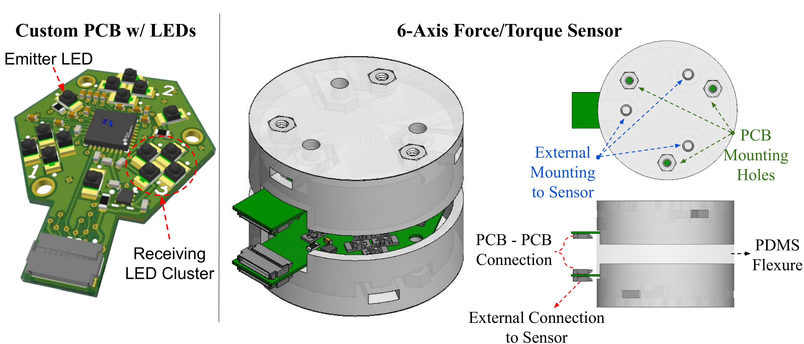
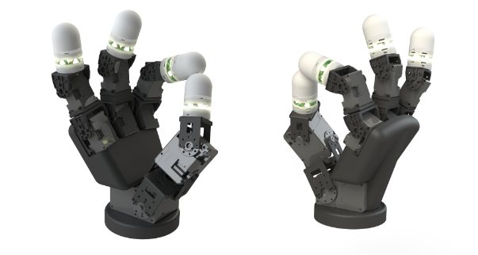
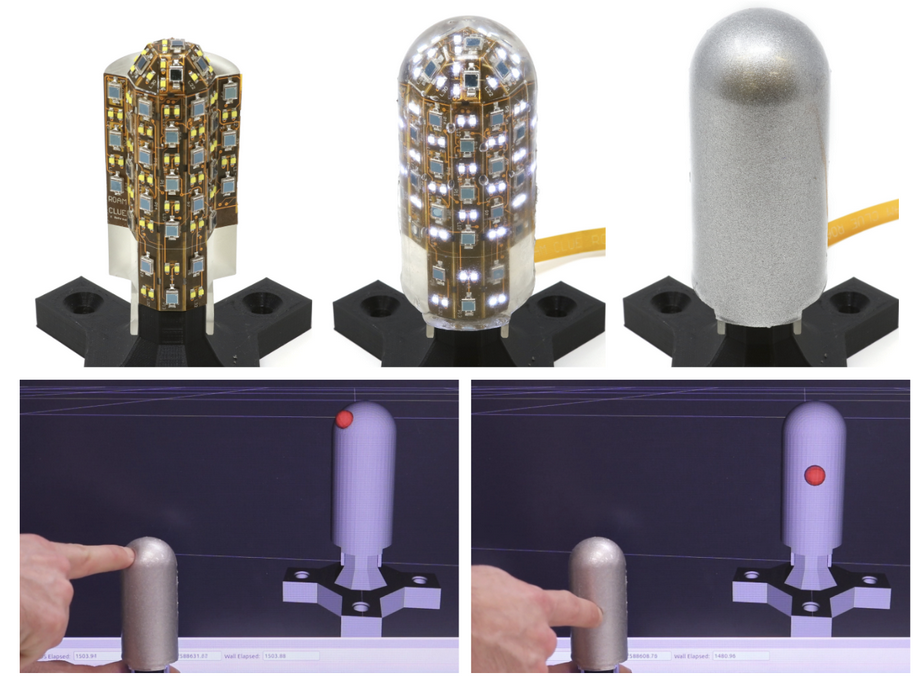
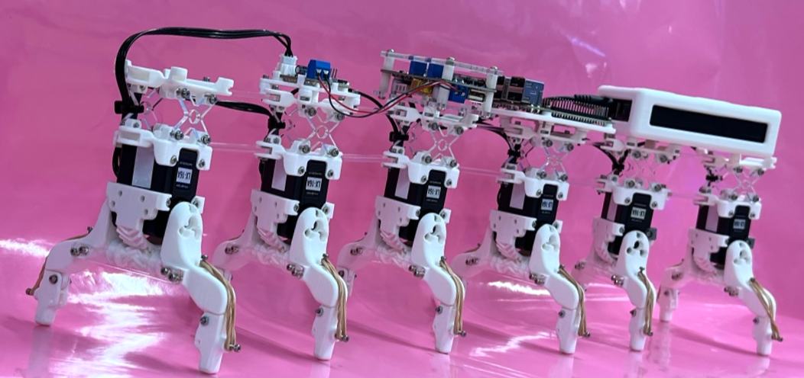
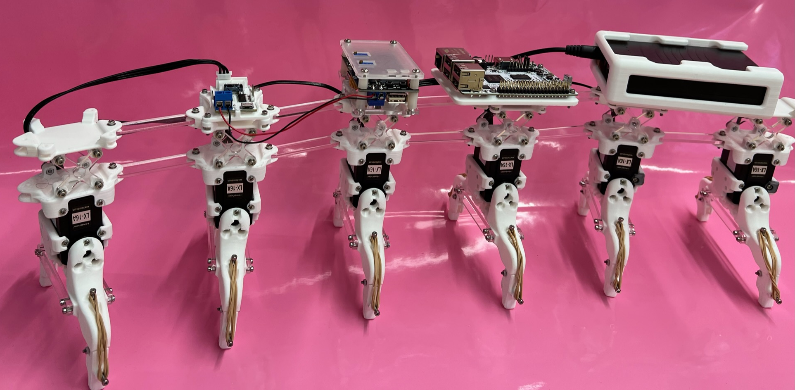
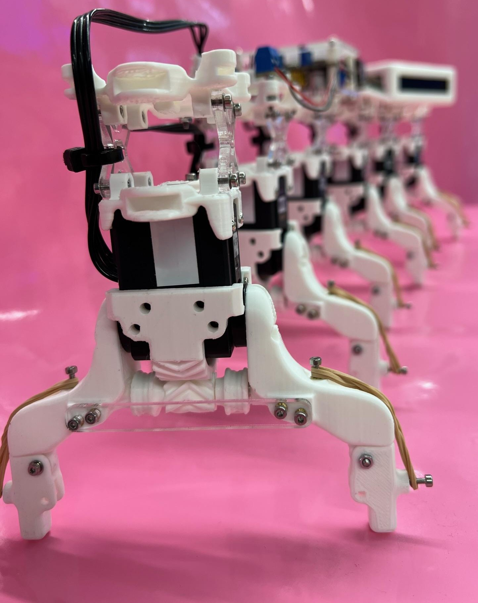
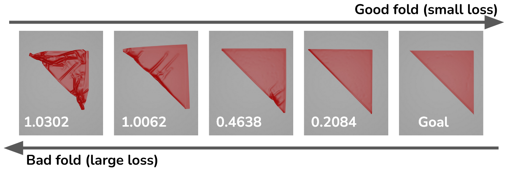
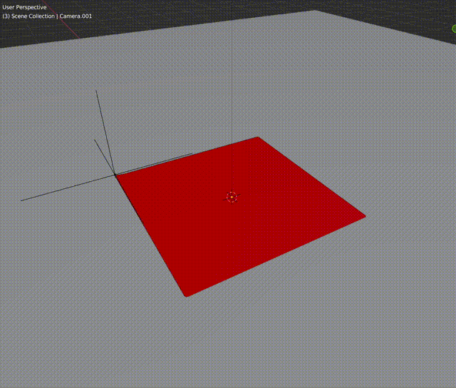

<!--
# Robotics Engineer

## Education
- M.S., Mechanical Engineering - Robotics Concentration	| Columbia University (_May 2024_)	 			        		
- B.S., Electrical and Computer Engineering | The University of Texas at Austin (_May 2020_)

-->

## Research
My research at the [ROAM Lab](https://roam.me.columbia.edu/) under [Matei Ciocarlie](https://roam.me.columbia.edu/people/matei-ciocarlie) focused on a mix of Tactile and Force Sensing, Robotic Manipulation and Control based on Tactile Data, and Data-Driven Neural Networks to empower physical sensors. My previous research under [Hod Lipson](https://www.me.columbia.edu/faculty/hod-lipson) was on Evolutionary Robotics and developing CUDA based simulations for better testing of robots.

**Compact LED-Based Displacement Sensing for Robot Fingers**

I lead the Electronic and Software design on a new 6-Axis Force Torque sensor designed to be placed in the joints of a full sensorized robotic hand. Done in Collaboration with Sharfin Islam (Mechanical Lead) and Pedro Piacenza.

<video height="300" alt="6-Axis FT Video" src="./assets/FT_Optic_ICRA.mp4" controls></video>
[Research Paper](https://arxiv.org/abs/2410.03481)

**Time-Series Models for Tactile Sensing**

I worked on expanding the original functionality of the [Disco Fingers](https://www.engineering.columbia.edu/about/news/highly-dexterous-robot-hand-can-operate-dark-just-us) (An Optics-Based Tactile Robot Finger) by introducing time-series data into the models for better prediction accuracy. Results showed that the models were much more precise for data provided during training and less sensitive to noise overall, but worse for extrapolating to new data. Done under the supervision of Eric Chang and Gagan Khandate.

**Project Mercury: CUDA Based Simulator and Evolutionary Development of Underwater Robots**

A year long project to first design both a CUDA based simulation environment (name Project Mercury) for simple spring-mass robots and then to develop algorithms for Evolving Underwater Robots. Our CUDA based simulator was able to simulate at 6x markup compared to Titan, the best contemporary simulator at the time. Done in collaboration with Dawson Cohen.

<video height="300" alt="Evolved Robots" src="./assets/Robot_Zoo.mp4" controls></video>

[Evo-Devo Research Paper](./assets/Evolutionary_Development_of_Soft_Body_Robotics.pdf)

[Project Mercury Research Paper](./assets/Mercury-Parallel_CUDA_Based_Simulator.pdf')

## Projects

**Robotic Studio - Centipede Robot**

A one-semester project to build a robot from scratch with minimal guidance. Along with Desmond O'Malley, I designed a concept for a centipede robot, implimented it in Solid Works, assembled the components, and created the drivers and control loop for its movement.

  

<video height="300" alt="Centipede Video" src="./assets/Centipede_Fastest_Motion.mp4" controls></video>

A full video of our process can be found here: 
<iframe height="300"
src="https://www.youtube.com/embed/ZToy9ocofvY?si=45ux5ayVsfle69Qg">
</iframe>

**Wrinkle Attentive Fabric**

A project to develop a new metric for evaluating tasks with deformable material. We developed a custom metric utilizing the depth data available in most RGB-D cameras like iPhones to evaluate how wrinkled a fabric is. We then combined it with Generalized Intersection over Union ([GIoU](https://giou.stanford.edu/)) to create a unified metric that can evaluate whether a fold is both accurate and clean. This project was later expanded on with a seperate group to develop a database to verify the metric versus expectations by human labelers.

 

[Research Paper](Wrinkle-attentive_Fabric_Manipulation_Metric.pdf)

## Mentoring
Since high school, I have a variety of experience in tutoring, mentoring, and teaching, as helping others understand things has always been a passion of mine.

**TA Experience**
- Graduate Teaching Assistant: Robot Learning at Columbia
    - Redesigned assignments for the updated curriculum
    - Held weekly office hours to assist students with comprehension of course content
- Undergraduate Teaching Assistant: Software Design and Implementation I & II at UT Austin
    - Was lead TA for multiple semesters in charge of designing recitation lectures and content
    - Served as a primary resource for Java, C, and algorithm questions and assignments
    - Spent a summer redesigning the curriculum along with professor Edison Thomaz including new content and assignments 

**Teaching Experience**
- Took multiple Teaching Classes on Curriculum Design and Pedagogy
- Taught Science Classes for Elementary School

**Tutoring Experience**
- Private Tutoring throughout Undergraduate and Graduate for Calculus and Engineering
- Organized an AP Chemistry and IB Physics Tutoring cohort for after school hours
- Organized writing tutoring groups for the literary magazine in High School, including a semester long program for the Special Education program

## Technical Skills:
**Coding**: Python, C++, Java, MATLAB, R-Stats, Rust, ROS 1 & 2, Linux

**Design Software**: Altium, Solidworks

**Languages**: English, Arabic, French

<!--
Portfolio Test 09-22

<video width="200" alt="test_video" src="./Centipede_Fastest_Motion.MOV" controls></video>
-->
